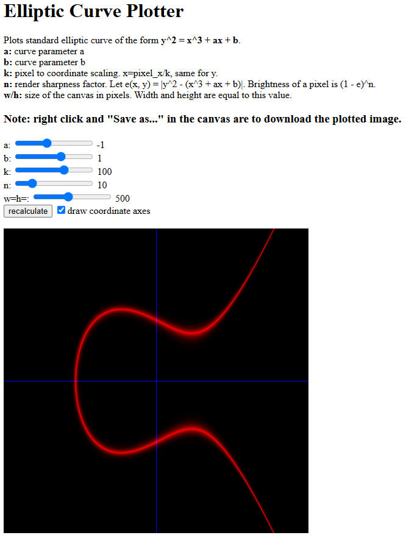

Interactive Elliptic Curve Plotting Tool
==

This is a dummy playground-like tool to explore elliptic curves of the form `y^2=x^3+ax+b`. All calculations are done in the monolithic HTML/JS file. MIT License.
